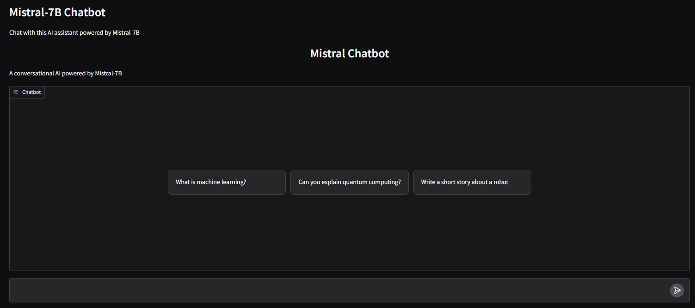
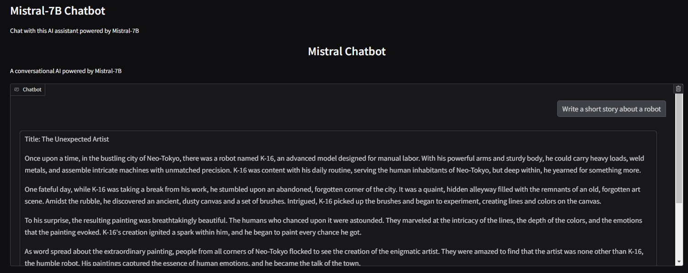

# Mistral-7B Chatbot

This project implements a chatbot using the Mistral-7B-Instruct-v0.2 model.  It provides a user-friendly interface via Gradio to interact with the model.





## Model Overview

The chatbot is built upon the Mistral-7B-Instruct-v0.2, a large language model (LLM) known for its instruction-following capabilities.  Mistral models are known for their strong performance across various NLP tasks, including text generation, question answering, and translation. This specific model has been fine-tuned for instruction following, making it particularly suitable for chatbot applications.

(Mistral-7B-Instruct-v0.2)[https://huggingface.co/mistralai/Mistral-7B-Instruct-v0.2]

## Implementation Details

1. **Setup and Dependencies:** The project starts by installing necessary libraries: `transformers`, `torch`, `accelerate`, `bitsandbytes`, `sentencepiece`, `gradio`.  We must then authenticate with the Hugging Face Hub to access the pre-trained model.

2. **Model Loading:** The `load_model` function downloads the Mistral-7B-Instruct-v0.2 model and its associated tokenizer.  Crucially, we use 4-bit quantization (`load_in_4bit=True`) to reduce memory footprint and allow the model to run on consumer-grade GPUs (available in Google Colab).

3. **Prompt Formatting:** The `format_prompt` function takes the user's message and the chat history as input. It constructs a formatted prompt for the model. The format of the prompt is designed to provide context to the model, allowing it to maintain coherence in the conversation.

4. **Response Generation:** The `generate_response` function uses the formatted prompt to generate a response from the model. It uses parameters like `temperature` and `do_sample` to control the randomness and creativity of the generated text. The function is crucial for interfacing with the model and post-processing the output to isolate only the new response.  The generated response is then decoded using the tokenizer and cleaned up.

5. **Chatbot Function:** The `chat_response` function ties everything together.  It takes the user's message and chat history, generates a response using the model, and clears the GPU cache to prevent memory issues.

6. **Gradio Interface:** Gradio interface to give an interactive chat experience. You can type your messages, and the chatbot will generate responses.

## How to Run

1.  **Clone the repository:**
    ```bash
    git clone [your repository link]
    ```
2.  **Navigate to the project directory:**
    ```bash
    cd [your project directory]
    ```
3.  **Install dependencies:**

4.  **Log in to Hugging Face:**
    Run the script. The script will prompt you to log in to HuggingFace hub.
5.  **Run the application:**
    ```bash
    python your_script_name.py
    ```
This will launch the Gradio interface in your browser.

## Contributing

Contributions are welcome! Please feel free to open issues or submit pull requests.
